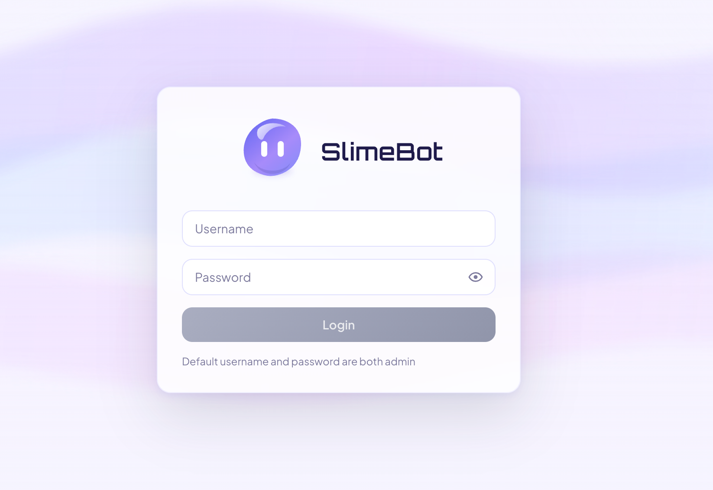
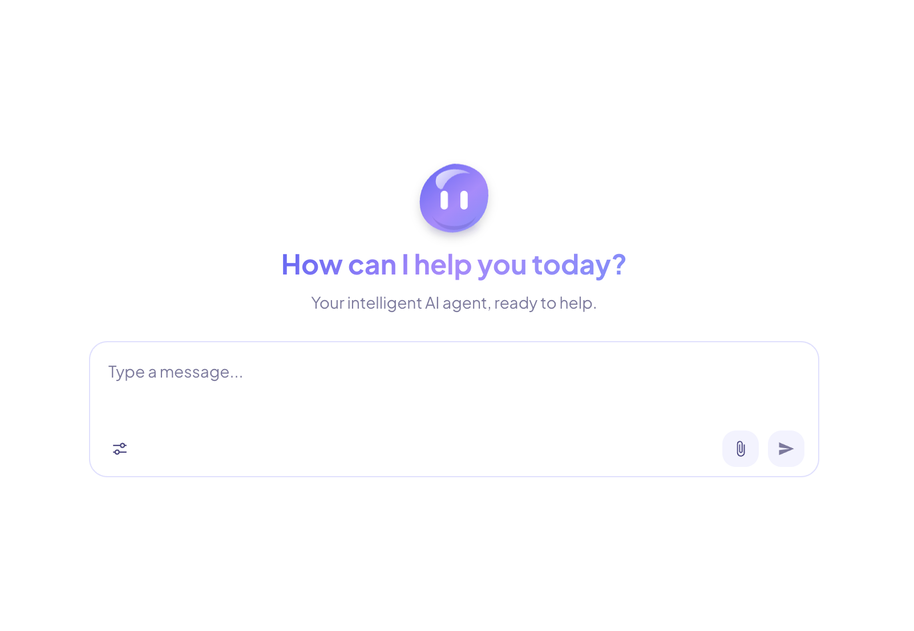
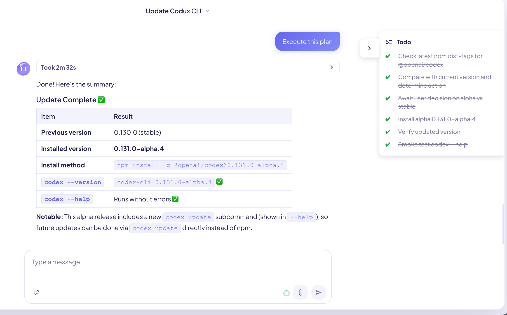
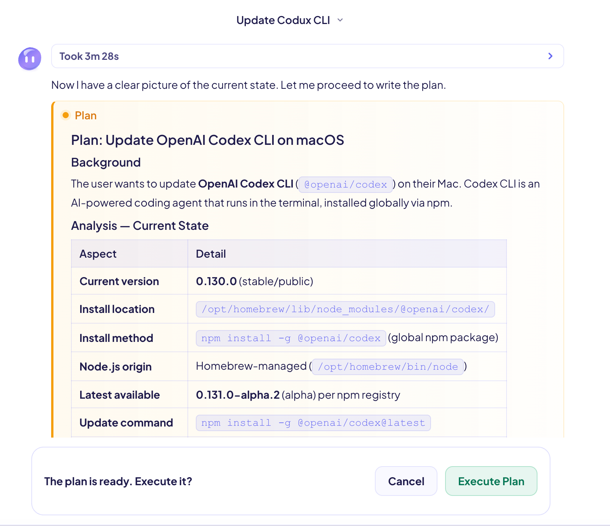
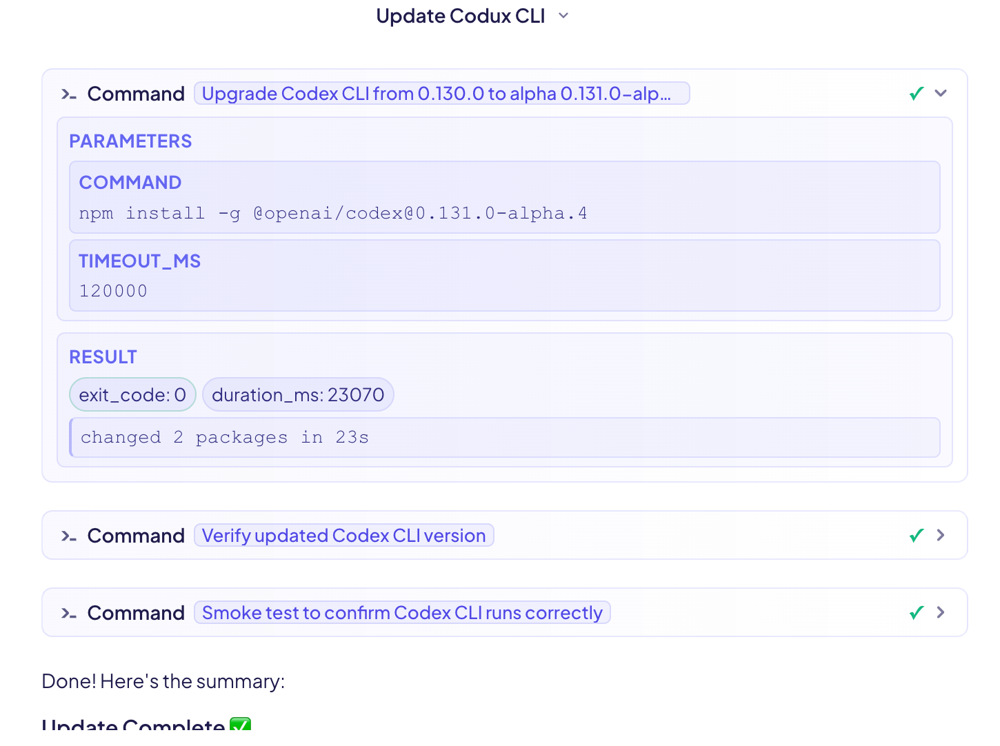
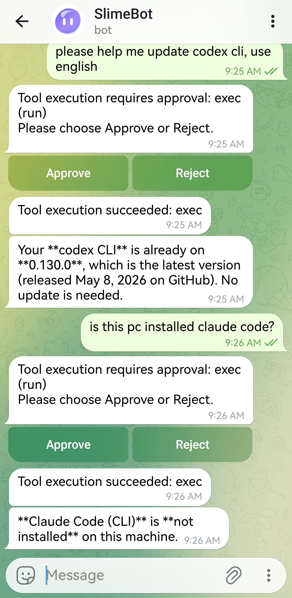
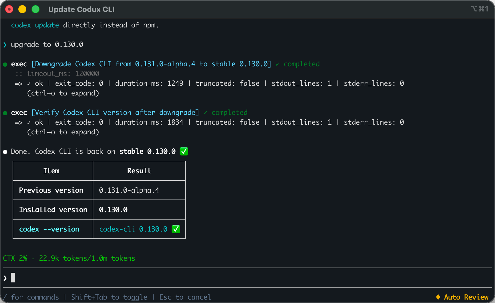

<p align="center">
  
  <br /><br />
  <strong>English</strong> | <a href="README.zh-CN.md">简体中文</a>
</p>

# SlimeBot

A personal AI agent demo: an extensible foundation for conversational AI apps. It ships with a **Go** backend, a **Vue 3** web UI, and a **React + Ink** terminal CLI.

## Features

- Chat sessions, real-time streaming replies, multimodal messages, and automatic title generation
- Agent tool-call flows with approval modes, sandbox policies, command/file tools, web requests, web search, and task tracking
- Plan mode, streamed thinking, context compression, MCP configuration, skills, and AGENTS.md instructions
- Web UI, CLI TUI, and Telegram integration

## Install From Release

Download the archive for your system from the project releases, extract it, then run the installer from the extracted directory.

macOS / Linux:

```bash
./install.sh
```

Windows PowerShell:

```powershell
.\install.ps1
```

The installer places SlimeBot under a user-local directory and creates command shims. If your shell cannot find `slimebot`, add the shim directory printed by the installer to `PATH`.

Before running the Web service, edit `~/.slimebot/config.cfg` and set a strong `JWT_SECRET`.

## Uninstall

Run the uninstaller from the extracted Release directory or from the installed copy.

macOS / Linux:

```bash
./uninstall.sh
```

Windows PowerShell:

```powershell
.\uninstall.ps1
```

The uninstaller stops and removes the system service, deletes the installed program files, and removes command shims. It asks before deleting `~/.slimebot` user data. Use `--purge` / `-Purge` to delete user data non-interactively, or `--yes` / `-Yes` to uninstall non-interactively while keeping user data.

## Commands

```bash
slimebot                         # start the CLI TUI
slimebot cli                     # start the CLI TUI explicitly
slimebot server                  # start the Web service in the foreground
slimebot service install         # install the Web service
slimebot service start           # start the Web service
slimebot service stop            # stop the Web service
slimebot service restart         # restart the Web service
slimebot service status          # show Web service status
slimebot service uninstall       # uninstall the Web service
slimebot version                 # show version information
slimebot help                    # show command help
```

Default Web port: **6247**. After the service starts, open `http://localhost:6247`.

First-time Web login seeds a default account if no user exists yet: username **`admin`**, password **`admin`**. Change it immediately.

## Manual Source Deployment

For development startup, production builds from source, Docker, Docker Compose, configuration, sandbox notes, and data layout, see [Manual Deployment](docs/manual-deployment.md).

## Screenshots

### Sign-in



### Home



### Chat



### Plan mode



### Tool execution



### Telegram



### CLI



## Status & Roadmap

**Done:** Web/CLI chat, WebSocket streaming, agent tools, approvals, sandbox enforcement, plan mode, thinking controls, subagents, MCP, skills, AGENTS.md instructions, SQLite-backed summaries, Telegram, multimodal chat, and JWT auth.

**Planned:** More messaging platforms such as Discord and Slack.

## License

This project is licensed under the [MIT License](LICENSE).
